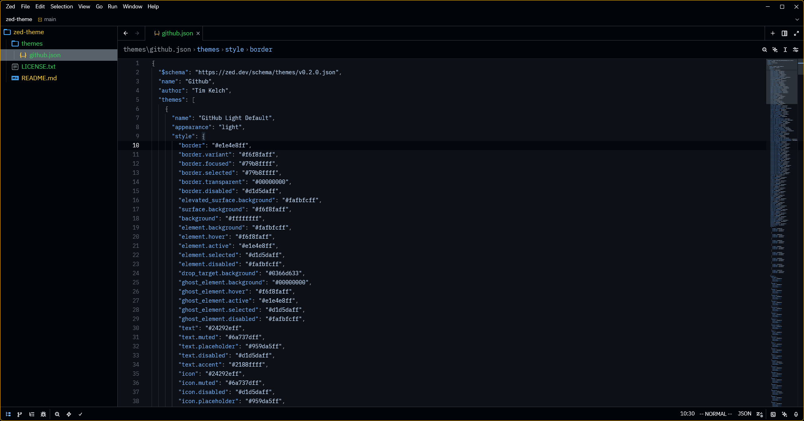
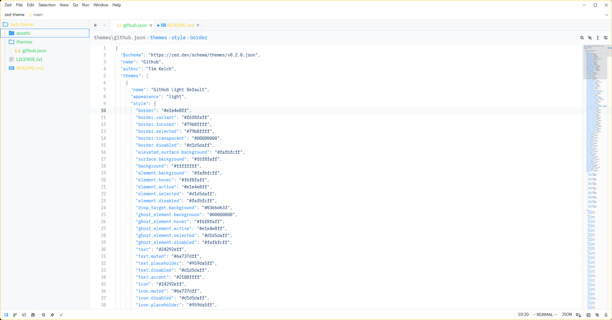

# zed-theme
A collection of GitHub-style themes for the Zed editor.

## Included Themes
- GitHub Light Default

- GitHub Dark Default

## Installation

Copy the theme JSON file (e.g. `github.json`) into your local Zed `themes` directory.

Unix-like systems:
`~/.config/zed/themes`

Windows:
`%APPDATA%\Roaming\Zed\themes`

If the `themes` directory doesn’t exist yet, create it.

After copying:
1. Open Zed.
2. Press `Ctrl+Shift+P` / `Cmd+Shift+P` and choose "Themes: Select Theme".
3. Pick "GitHub Light Default" or "GitHub Dark Default".

## Notes
- Dark theme base background: `#010409` with editor surface `#0d1117`.
- Light theme uses classic GitHub light palette.
- Feel free to customize further by editing `github.json`.

## Contributing
Submit improvements or additional variants (High Contrast, Colorblind, Dimmed) by opening a pull request.
